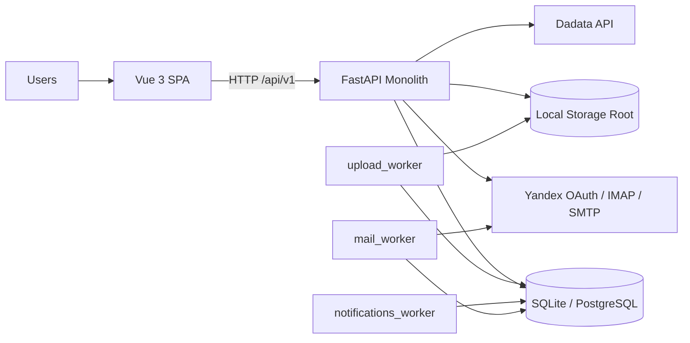
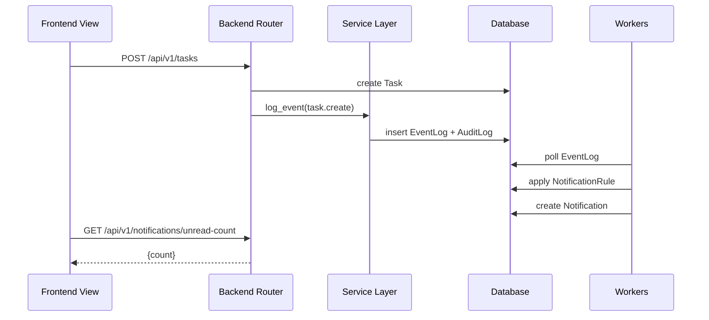

# NMBD Tech CRM

Монолитная CRM-платформа для управления строительными сделками, контрактами, задачами, документооборотом, казначейством и исполнением работ.

## Что Входит В Систему
- `backend` (FastAPI + SQLAlchemy async): единый REST API и бизнес-логика.
- `frontend` (Vue 3 + Vite + Pinia): SPA интерфейс для всех ролей.
- Фоновые воркеры:
  - `backend/upload_worker.py` - асинхронная обработка очереди загрузок файлов.
  - `backend/notifications_worker.py` - движок правил уведомлений, overdue и digest.
  - `backend/mail_worker.py` - периодическая синхронизация почтовых ящиков.

## Архитектура


## Схема Взаимодействия Компонентов


## Базовые Правила Доступа И Безопасности
- Все `/api/v1/*` endpoints требуют JWT (кроме явно открытых auth-paths).
- Для мутационных операций в `roles/users/companies` действует write-guard:
  - доступ разрешен только `superuser` или роли с `read_all=true` в нужной секции,
  - при отсутствии прав API возвращает `HTTP 403` (`Write access denied for section: <section>`).
- Для файловых операций локального storage используется защита от Path Traversal:
  - проверка путей через `Path.resolve()` и проверка принадлежности корню хранилища.

## Технологический Стек
- Backend: `FastAPI 0.104`, `SQLAlchemy 2.x`, `Pydantic 2.x`, `Uvicorn`.
- Frontend: `Vue 3`, `Vite 6`, `Pinia`, `Vue Router`, `Axios`.
- Хранилище: локальная ФС через `STORAGE_LOCAL_ROOT`.
- База данных:
  - локально: SQLite (дефолтный `crm.db`),
  - production: PostgreSQL (через `SQLALCHEMY_DATABASE_URI`).

## Структура Репозитория
```text
backend/
  app/
    core/         # auth middleware, security, settings
    database/     # engine/session/declarative base
    models/       # SQLAlchemy модели (73 файла)
    schemas/      # Pydantic схемы API (47 файлов)
    routers/      # REST endpoints (48 роутеров, ~466 endpoints)
    services/     # доменная и инфраструктурная логика
  *worker.py      # фоновые процессы
  create_*.py     # инициализация/миграционные скрипты
frontend/
  src/
    views/        # страницы (~42, вкл. модуль Тех. поддержки)
    components/   # UI и глобальные компоненты
    router/       # таблица маршрутов и guard'ы
    stores/       # auth/upload queue
docs/
  README.md       # индекс документации
  API.md          # входная точка в модульную API-документацию
  api/            # API reference по бизнес-доменам
  INTERNAL.md     # внутреннее устройство системы
```

## Установка И Запуск (Dev)

### 1. Backend
```bash
cd backend
python -m venv .venv
# Windows
.venv\Scripts\activate
# Linux/macOS
source .venv/bin/activate
pip install -r requirements.txt
uvicorn main:app --reload --host 0.0.0.0 --port 8000
```

### 2. Workers
В отдельных терминалах:
```bash
cd backend
python upload_worker.py
python notifications_worker.py
python mail_worker.py
```

### 3. Frontend
```bash
cd frontend
npm install
npm run dev
```

### 4. URLs
- Frontend: `http://localhost:3000`
- Backend: `http://localhost:8000`
- OpenAPI/Swagger: `http://localhost:8000/docs`

## Переменные Окружения (`backend/.env`)

| Variable | Required | Default | Назначение |
| --- | --- | --- | --- |
| `SECRET_KEY` | Yes (prod) | `your-secret-key-here-change-in-production` | Подпись JWT и state для OAuth |
| `ALGORITHM` | No | `HS256` | Алгоритм JWT |
| `ACCESS_TOKEN_EXPIRE_MINUTES` | No | `60` | TTL access token |
| `REFRESH_TOKEN_EXPIRE_MINUTES` | No | `43200` | TTL refresh token |
| `SUPERUSER_ROLE_NAMES` | No | встроенный список | Имена ролей для superuser-режима |
| `SQLALCHEMY_DATABASE_URI` | Yes | `sqlite:///.../crm.db` | DSN БД (SQLite/PostgreSQL) |
| `BACKEND_CORS_ORIGINS` | No | встроенный список localhost + for-apps.ru | CORS whitelist |
| `DADATA_TOKEN` | Optional | `""` | Интеграция Dadata (`/banks`, `/dadata`, refresh компаний) |
| `STORAGE_BACKEND` | No | `""` -> `local` | Режим storage, в текущем коде реализован local |
| `STORAGE_LOCAL_ROOT` | Yes для файловых модулей | `""` | Корень файлового хранилища |
| `OUTGOING_NUMBER_START` | No | `1193` | Старт нумерации исходящих |
| `KP_NUMBER_START` | No | `600` | Старт нумерации КП |
| `UPLOAD_TMP_DIR` | No | `backend/tmp_uploads` | Временная директория upload-очереди |
| `UPLOAD_TMP_MAX_BYTES` | No | `53687091200` | Лимит размера upload |
| `UPLOAD_TMP_TTL_HOURS` | No | `24` | TTL временных файлов |
| `MAIL_POLL_INTERVAL_SECONDS` | No | `60` | Интервал синка почты (min 10 сек) |
| `YANDEX_OAUTH_CLIENT_ID` | Optional (mail oauth) | `""` | OAuth client id |
| `YANDEX_OAUTH_CLIENT_SECRET` | Optional (mail oauth) | `""` | OAuth client secret |
| `YANDEX_OAUTH_REDIRECT_URI` | Optional (mail oauth) | `""` | Redirect URI для callback |
| `YANDEX_OAUTH_SCOPES` | No | `mail:imap_ro mail:smtp` | OAuth scope |

Legacy/совместимость (обнаружены в `backend/.env`, в текущем коде напрямую не используются):
- `YANDEX_TOKEN`
- `YANDEX_ROOT_PATH`

## Документация
- `docs/README.md` - индекс документации.
- `docs/API.md` - входная точка в модульный API reference.
- `docs/api/INDEX.md` - карта API-доменов, общие правила и ссылки на файлы `docs/api/*.md`.
- `docs/INTERNAL.md` - внутреннее устройство, ответственность модулей, ошибки и логирование.
- `docs/OPERATIONS.md` - эксплуатационный runbook (релизы, инциденты, backup/restore).
- `docs/PROJECT_OVERVIEW.md` - бизнес-обзор подсистем.
- `docs/DEPLOYMENT.md` - деплой и эксплуатация.
- `docs/OUTGOING_REGISTRY.md` - специализированный модуль исходящей документации.
