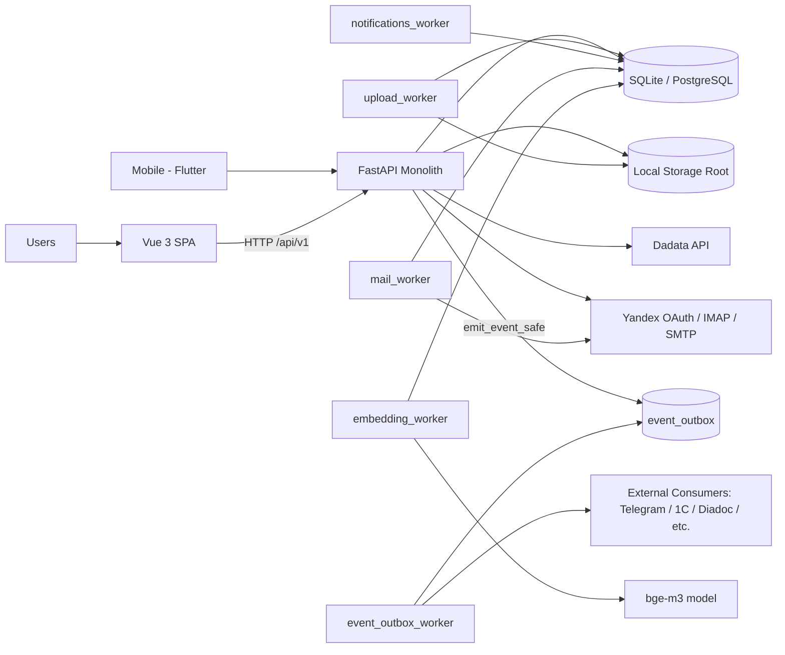
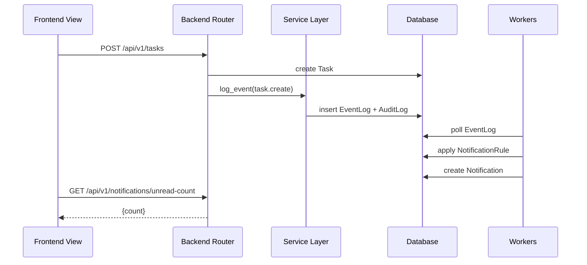

# Nexus Tech CRM

Монолитная CRM-платформа для управления строительными сделками, контрактами, задачами, документооборотом, казначейством, корпоративными коммуникациями, HR, нормативной базой и исполнением работ.

## Что Входит В Систему
- `backend` (FastAPI + SQLAlchemy async): единый REST API и бизнес-логика, 56 роутеров в 9 доменах (auth/crm/finance/documents/communications/legal_compliance/hr/platform/analytics).
- `frontend` (Vue 3 + Vite + Pinia): SPA интерфейс для всех ролей, ~53 страницы.
- `mobile_app` (Flutter): мобильный клиент для iOS/Android (CI через Codemagic).
- Фоновые воркеры:
  - `backend/upload_worker.py` - асинхронная обработка очереди загрузок файлов.
  - `backend/notifications_worker.py` - движок правил уведомлений, overdue и digest.
  - `backend/mail_worker.py` - периодическая синхронизация почтовых ящиков.
  - `backend/event_outbox_worker.py` - Event Bus v2: транзакционный outbox + retry/DLQ + HMAC + JSON-Logic фильтрация подписок.
  - `backend/embedding_worker.py` - гибридный поиск: вычисление bge-m3 embeddings (1024-dim) для FTS5-индексированных сущностей.

## Архитектура


## Схема Взаимодействия Компонентов


## Базовые Правила Доступа И Безопасности
- Все `/api/v1/*` endpoints требуют JWT (кроме явно открытых auth-paths).
- Для мутационных операций в `roles/users/companies` действует write-guard:
  - доступ разрешен только `superuser` или роли с `read_all=true` в нужной секции,
  - при отсутствии прав API возвращает `HTTP 403` (`Write access denied for section: <section>`).
- Для файловых операций локального storage используется защита от Path Traversal:
  - проверка путей через `Path.resolve()` и проверка принадлежности корню хранилища.

## Технологический Стек
- Backend: `FastAPI 0.104`, `SQLAlchemy 2.x`, `Pydantic 2.x`, `Uvicorn`.
- Frontend: `Vue 3`, `Vite 6`, `Pinia`, `Vue Router`, `Axios`.
- Хранилище: локальная ФС через `STORAGE_LOCAL_ROOT`.
- База данных:
  - локально: SQLite (дефолтный `crm.db`),
  - production: PostgreSQL (через `SQLALCHEMY_DATABASE_URI`).

## Структура Репозитория
```text
backend/
  app/
    core/             # auth middleware, security, settings, rate-limit
    database/         # engine/session/declarative base
    models/           # SQLAlchemy модели (84 файла)
    schemas/          # Pydantic схемы API (52 файла)
    routers/          # REST endpoints (56 роутеров, ~536 endpoints)
    services/         # доменная и инфраструктурная логика
    event_handlers/   # подписчики Event Bus v2 (search indexer + per-entity hooks)
  *worker.py          # фоновые процессы (upload/notifications/mail/event_outbox/embedding)
  create_*.py         # инициализация и миграционные скрипты
  migrate_*.py        # миграции (mixed legacy style)
frontend/
  src/
    views/            # страницы (~53)
    components/       # UI и глобальные компоненты (включая MentionInput с auto-grow, ProfileDrawer, и др.)
    composables/      # composable-логика (12 файлов: useIdleTracker, useServerClock, useUiPreferences и др.)
    router/           # таблица маршрутов и section-based guard'ы
    stores/           # auth/upload queue/notifications/workday
    services/         # HTTP interceptors + API-обёртки по доменам
    config/           # конфиги навигации, типов объектов
    directives/       # пользовательские директивы
mobile_app/           # Flutter-клиент (iOS + Android)
docs/
  README.md           # индекс документации
  API.md              # входная точка (генерируется)
  api/                # API reference по 9 доменам
  INTERNAL.md         # внутреннее устройство (включая §9 архитектурные паттерны)
  EVENTS_*.md         # документация Event Bus v2
```

## Установка И Запуск (Dev)

### 1. Backend
```bash
cd backend
python -m venv .venv
# Windows
.venv\Scripts\activate
# Linux/macOS
source .venv/bin/activate
pip install -r requirements.txt
uvicorn main:app --reload --host 0.0.0.0 --port 8000
```

### 2. Workers
В отдельных терминалах:
```bash
cd backend
python upload_worker.py
python notifications_worker.py
python mail_worker.py
python event_outbox_worker.py        # Event Bus v2 (опц., если используются интеграции)
python embedding_worker.py            # hybrid search (опц., при ENABLE_HYBRID_SEARCH=1)
```

### 3. Frontend
```bash
cd frontend
npm install
npm run dev
```

### 4. URLs
- Frontend: `http://localhost:3000`
- Backend: `http://localhost:8000`
- OpenAPI/Swagger: `http://localhost:8000/docs`

## Переменные Окружения (`backend/.env`)

| Variable | Required | Default | Назначение |
| --- | --- | --- | --- |
| `SECRET_KEY` | Yes (prod) | `your-secret-key-here-change-in-production` | Подпись JWT и state для OAuth |
| `ALGORITHM` | No | `HS256` | Алгоритм JWT |
| `ACCESS_TOKEN_EXPIRE_MINUTES` | No | `60` | TTL access token |
| `REFRESH_TOKEN_EXPIRE_MINUTES` | No | `43200` | TTL refresh token |
| `SUPERUSER_ROLE_NAMES` | No | встроенный список | Имена ролей для superuser-режима |
| `SQLALCHEMY_DATABASE_URI` | Yes | `sqlite:///.../crm.db` | DSN БД (SQLite/PostgreSQL) |
| `BACKEND_CORS_ORIGINS` | No | встроенный список localhost + for-apps.ru | CORS whitelist |
| `DADATA_TOKEN` | Optional | `""` | Интеграция Dadata (`/banks`, `/dadata`, refresh компаний) |
| `STORAGE_BACKEND` | No | `""` -> `local` | Режим storage, в текущем коде реализован local |
| `STORAGE_LOCAL_ROOT` | Yes для файловых модулей | `""` | Корень файлового хранилища |
| `OUTGOING_NUMBER_START` | No | `1193` | Старт нумерации исходящих |
| `KP_NUMBER_START` | No | `600` | Старт нумерации КП |
| `UPLOAD_TMP_DIR` | No | `backend/tmp_uploads` | Временная директория upload-очереди |
| `UPLOAD_TMP_MAX_BYTES` | No | `53687091200` | Лимит размера upload |
| `UPLOAD_TMP_TTL_HOURS` | No | `24` | TTL временных файлов |
| `MAIL_POLL_INTERVAL_SECONDS` | No | `60` | Интервал синка почты (min 10 сек) |
| `YANDEX_OAUTH_CLIENT_ID` | Optional (mail oauth) | `""` | OAuth client id |
| `YANDEX_OAUTH_CLIENT_SECRET` | Optional (mail oauth) | `""` | OAuth client secret |
| `YANDEX_OAUTH_REDIRECT_URI` | Optional (mail oauth) | `""` | Redirect URI для callback |
| `YANDEX_OAUTH_SCOPES` | No | `mail:imap_ro mail:smtp` | OAuth scope |
| `ENABLE_HYBRID_SEARCH` | No | `0` | Включить гибридный поиск (FTS5 + bge-m3); требует установленных `sentence-transformers` + `sqlite-vec` + загруженной модели bge-m3 |
| `BGE_M3_MODEL_PATH` | No | встроенный | Путь к локально загруженной модели bge-m3 (или имя для HuggingFace cache) |
| `EVENT_BUS_HMAC_SECRET` | Optional | `""` | Секрет для подписи исходящих webhook'ов из Event Bus подписчикам |

Legacy/совместимость (обнаружены в `backend/.env`, в текущем коде напрямую не используются):
- `YANDEX_TOKEN`
- `YANDEX_ROOT_PATH`

## Документация
- `docs/README.md` - индекс документации.
- `docs/API.md` - входная точка в модульный API reference (автогенерируется из кода через `python scripts/generate_api_reference.py`).
- `docs/api/INDEX.md` - карта API-доменов (9 доменов: auth/crm/finance/documents/communications/legal_compliance/hr/platform/analytics), общие правила и ссылки на файлы `docs/api/*.md`.
- `docs/INTERNAL.md` - внутреннее устройство, ответственность модулей, ошибки и логирование, ключевые архитектурные паттерны (включая §9: per-row ACL для child-entity, гибридный поиск FTS5+bge-m3+RRF, Event Bus v2, feed image/file storage).
- `docs/OPERATIONS.md` - эксплуатационный runbook (релизы, инциденты, backup/restore).
- `docs/PROJECT_OVERVIEW.md` - бизнес-обзор подсистем.
- `docs/DEPLOYMENT.md` - деплой и эксплуатация.
- `docs/OUTGOING_REGISTRY.md` - специализированный модуль исходящей документации.
- `docs/EVENTS_API.md`, `docs/EVENTS_ENTITY_REFERENCE.md`, `docs/events.json` - публичный API и каталог событий Event Bus v2 (~140+ типов).
- `docs/INTEGRATIONS_ONBOARDING.md` - подключение нового внешнего consumer'а к Event Bus.
- `docs/MOBILE_FLUTTER_MVP.md`, `docs/IOS_CLOUD_BUILD_TESTFLIGHT.md` - мобильный клиент и iOS-сборка.
- `SECURITY_ASSESSMENT_2026-05-18.md` (корень) - срез безопасности.
- `SETUP_COLLEAGUE.md` (корень) - онбординг нового разработчика с нуля.
