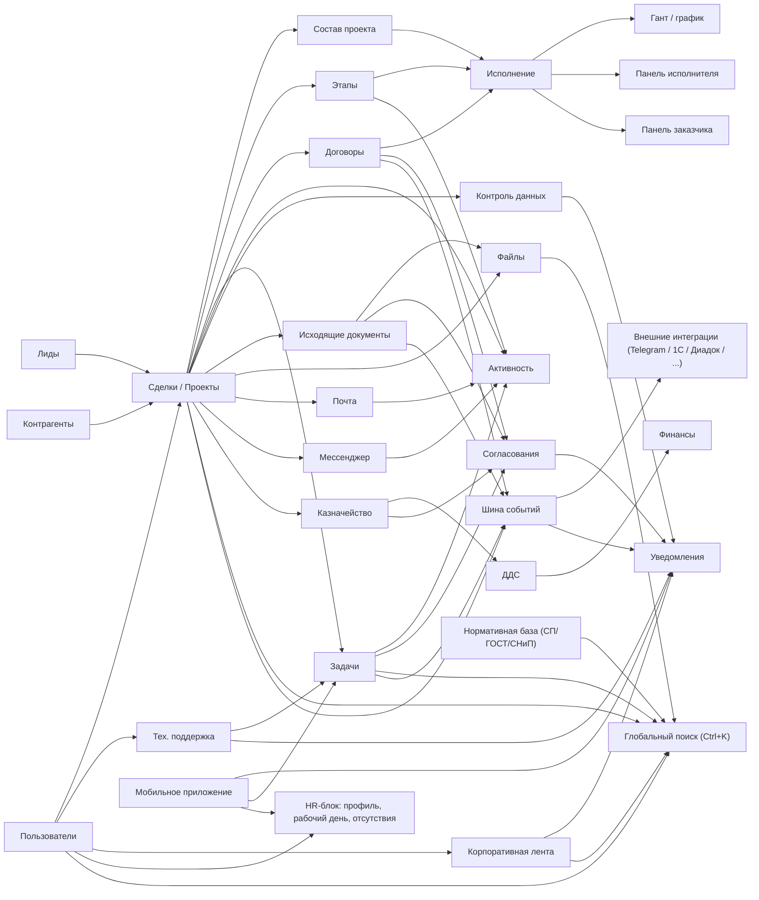
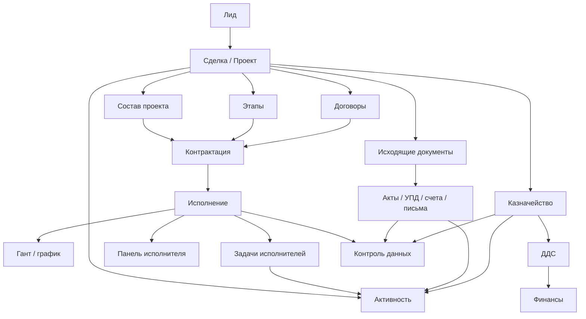
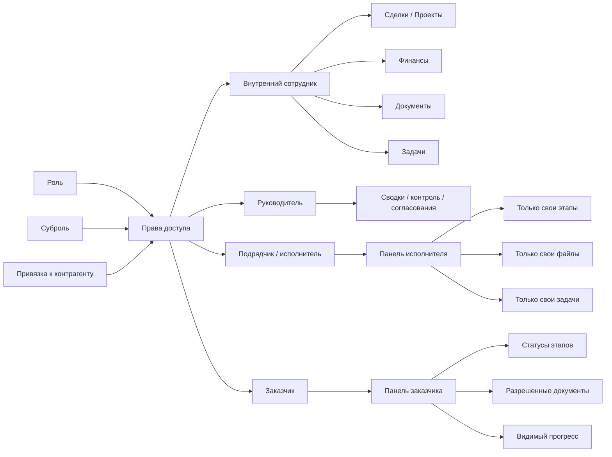
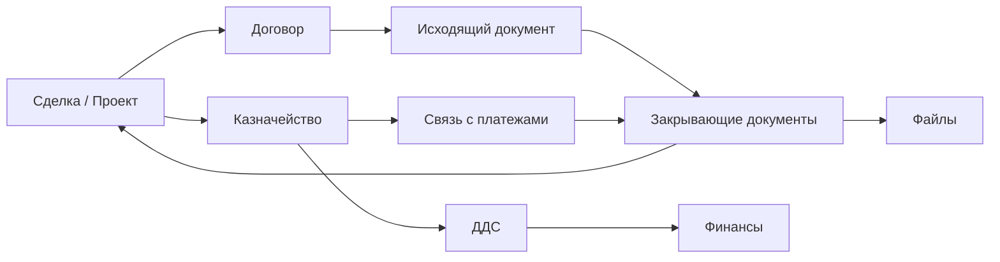
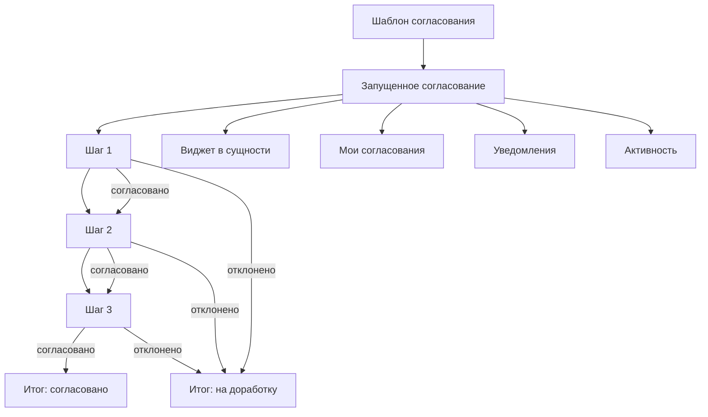
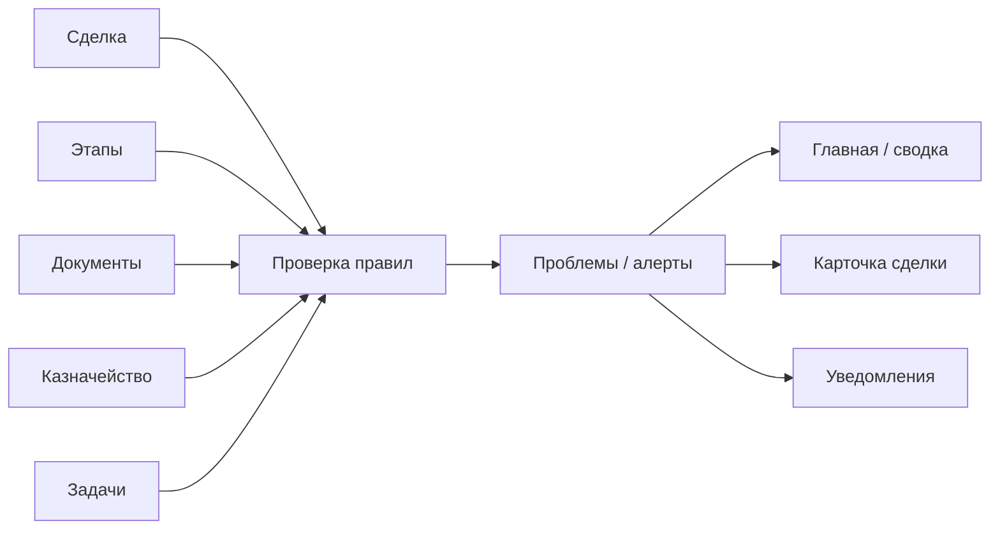
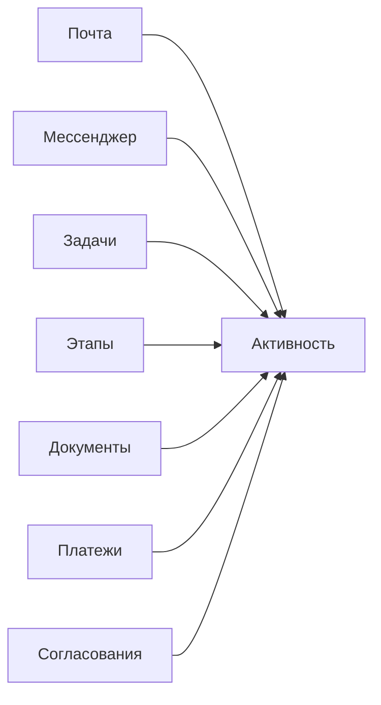

# Визуальная карта системы для администратора

Документ нужен для нетехнического администратора системы.

Цель:
- быстро понять, из каких блоков состоит ERP;
- как сущности связаны между собой;
- какие правила работают автоматически;
- где пользователь видит результат этих правил.

Как читать документ:
- каждый блок на схеме — это раздел системы или ключевая сущность;
- стрелка показывает, куда данные переходят или на что влияют;
- под каждой схемой есть короткие правила простым языком.

---

## 1. Главная карта системы

### Что это значит

- `Сделка / Проект` — центральная сущность системы. Почти все остальные блоки привязаны к ней.
- `Состав проекта` описывает, что именно продается или выполняется в рамках проекта.
- `Этапы` описывают, как проект выполняется по шагам и срокам.
- `Исполнение` показывает, что происходит по факту: кто делает, когда делает, что завершено.
- `Исходящие документы`, `Файлы`, `Почта`, `Мессенджер` — документарный и коммуникационный слой проекта.
- `Казначейство`, `ДДС`, `Финансы` — денежный контур проекта.
- `Согласования`, `Контроль данных`, `Уведомления`, `Активность` — сквозные сервисные блоки, которые работают сразу для нескольких разделов.
- `Тех. поддержка` — обращения пользователей: заявитель видит только свои тикеты, сотрудник поддержки видит все и может превратить тикет в задачу.
- `Корпоративная лента` — общая площадка для постов компании: новости, опросы, реакции, картинки и файлы. Пишет события в `Уведомления`.
- `HR-блок` — профиль сотрудника, учёт рабочего времени и отсутствий. Видимость регулируется отдельными правами `profiles` / `workday` / `absences`.
- `Нормативная база` — каталог СП/ГОСТ/СНиП для проектировщиков. Имеет собственный поиск и не пересекается с основными бизнес-данными.
- `Глобальный поиск` — единая точка поиска по сделкам, задачам, файлам, ленте, нормам. Соблюдает права доступа пользователя.
- `Шина событий` — отдаёт события из системы во внешние интеграции (Telegram, 1С, Диадок и т.п.) по подпискам.
- `Мобильное приложение` — Flutter-клиент для iOS/Android: уведомления, задачи, рабочее время.

---

## 2. Жизненный сценарий проекта

### Основная логика

- сначала в системе появляется `Лид`;
- после квалификации он превращается в `Сделку / Проект`;
- внутри сделки появляются:
  - `Состав проекта`;
  - `Этапы`;
  - `Договоры`;
- дальше они собираются в контур `Контрактации` и `Исполнения`;
- параллельно формируются:
  - документы;
  - финансы;
  - задачи;
  - история активности;
- `Контроль данных` проверяет, не нарушены ли правила проекта.

---

## 3. Кто что видит

### Правила доступа

- `Роль` определяет, какие разделы вообще доступны пользователю.
- `Суброль` определяет, какой именно бизнес-сценарий у пользователя.
- `Привязка к контрагенту` особенно важна для подрядчиков и исполнителей.
- Подрядчик не должен видеть весь проект целиком.
- Подрядчик видит только:
  - свои этапы;
  - свои тома/работы;
  - свои документы;
  - свои задачи;
  - свои чаты и файлы.
- Заказчик видит только тот срез проекта, который разрешен для клиентского кабинета.

---

## 4. Документы и деньги

### Базовые правила

- документы и деньги должны быть связаны со `Сделкой`;
- `Договор` — юридическая основа;
- `Исходящие документы` создаются в контексте проекта и часто в контексте договора;
- `Закрывающие документы` должны быть видны:
  - в сделке;
  - в этапах;
  - в договоре;
- `Казначейство` фиксирует факт движения денег;
- `ДДС` показывает, как эти движения классифицируются;
- `Финансы` показывают итоговую аналитику.

---

## 5. Согласования

### Где согласования уже должны быть понятны пользователю

- в самой сущности:
  - задача;
  - исходящий документ;
  - договор;
  - финансовая операция;
- на отдельной странице `Мои согласования`;
- в `Уведомлениях`;
- в `Активности`.

### Простые правила согласований

- у согласования есть `шаблон`;
- у шаблона есть `шаги`;
- у каждого шага есть согласующий;
- пока согласование не завершено, важное действие может быть заблокировано;
- если шаг отклонен, объект уходит на доработку;
- если последний шаг согласован, объект получает разрешение на следующий бизнес-шаг.

---

## 6. Контроль данных

### Что должен понимать администратор

- `Контроль данных` — это не просто список ошибок;
- это система раннего предупреждения;
- она должна показывать:
  - что не заполнено;
  - что выбивается из правил;
  - что мешает следующему шагу;
  - что потенциально сорвет срок, документ или оплату.

---

## 7. Активность

### Главная идея

- `Активность` — это единая история жизни проекта;
- пользователь должен видеть в одном месте:
  - что произошло;
  - кто это сделал;
  - к какому объекту относится событие;
  - что нужно делать дальше.

---

## 8. Краткие правила системы

### Центральная сущность

- центр системы — `Сделка / Проект`;
- если новый объект нельзя логично привязать к сделке, его место в модели нужно пересмотреть.

### Правило доступа

- доступ строится не только по роли, но и по бизнес-привязке пользователя.

### Правило выполнения

- этапы, тома/работы и исполнение должны быть согласованы между собой.

### Правило документов

- документы не должны жить отдельно от проекта, договора и статуса исполнения.

### Правило денег

- финансовые операции должны быть понятны в разрезе проекта и документов.

### Правило согласований

- согласование должно быть видно не только админу, но и обычному пользователю в рабочем процессе.

### Правило контроля

- проблемы должны показываться как понятные действия, а не как технические ошибки.

---

## 9. Для чего использовать этот документ

- для ввода нового администратора в систему;
- для общения с руководителем или операционным менеджером;
- для обсуждения, какие блоки уже есть и как они должны работать вместе;
- как визуальную основу перед проектированием новых правил, согласований и прав доступа.

