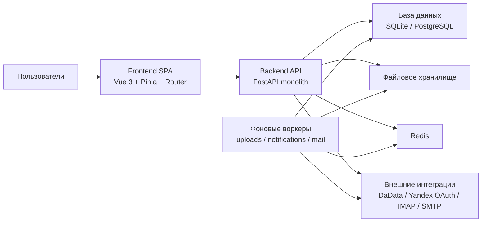
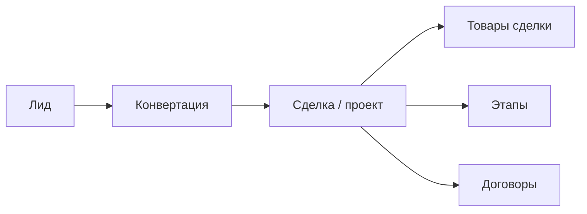
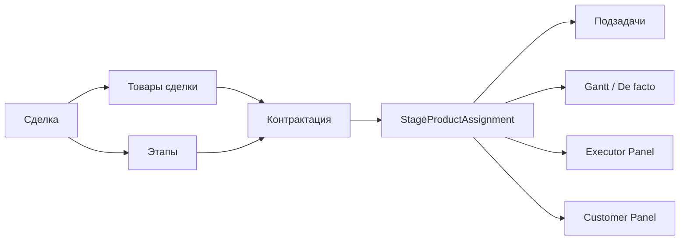
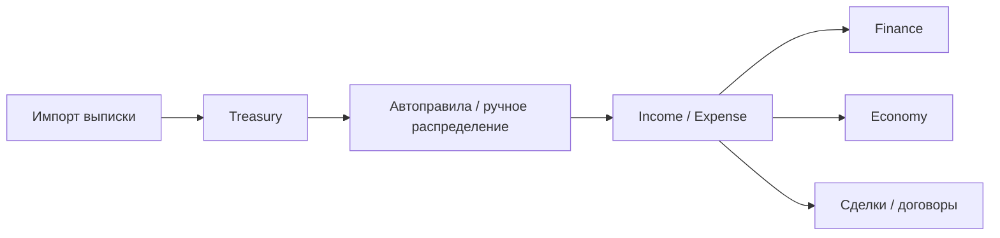
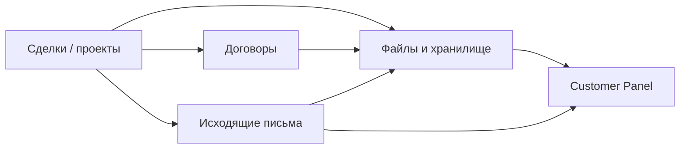

# Developer Architecture Guide

Документ предназначен для разработчика, который подключается к проекту и должен быстро понять:

- что делает система;
- какие в ней есть ключевые модули;
- как между собой связаны бизнес-процессы;
- где в коде находится основная логика;
- в какие точки обычно вносятся изменения.

Документ не заменяет `docs/API.md`, `docs/INTERNAL.md` и `docs/PROJECT_OVERVIEW.md`, а дает практичную карту входа в систему.

## 1. Что Это За Система

`Nexus ERP` — это монолитная CRM/ERP-платформа для проектно-строительной компании.

Система объединяет в одном контуре:

- продажи и квалификацию лидов;
- ведение сделок и карточек проектов;
- этапы, товары, план-графики и исполнение;
- договоры и документы;
- задачи, аукционы, панели исполнителей;
- казначейство, ДДС, финансы и экономику;
- исходящие письма, файловое хранилище, почту, чаты и уведомления;
- внешний кабинет заказчика.

На практике это означает, что почти все рабочие сценарии сходятся в карточке проекта (`Project Detail`), а вокруг нее строятся остальные модули.

## 2. Архитектура На Верхнем Уровне

### 2.1 Техническая схема



### 2.2 Главный принцип

Система реализована как монолит:

- frontend — одно SPA-приложение;
- backend — один FastAPI-сервис с большим набором роутеров;
- доменная логика в основном сосредоточена в `backend/app/services`;
- тяжелые фоновые сценарии вынесены в отдельные worker-процессы;
- файловые сценарии завязаны на локальное хранилище и storage-роутеры.

## 3. Центральная Бизнес-Модель

Если упростить всю предметную область до одной цепочки, она выглядит так:

```text
Лид -> Сделка/проект -> Товары -> Этапы -> Контрактация -> Исполнение -> Платежи -> Документы -> Внешние кабинеты
```

Главная сущность системы — `Deal` (сделка / проект).

Именно к сделке привязываются:

- карточка объекта;
- заказчик и другие компании;
- товары сделки;
- этапы;
- договоры;
- оплаты;
- документы;
- письма;
- исполнители;
- gantt и de-facto исполнение.

## 4. Основные Бизнес-Контуры

### 4.1 CRM: лиды, сделки, компании

Контур отвечает за входящий поток и инициацию проекта:

- `Leads` — квалификация входящих возможностей;
- `Projects` — реестр активных сделок;
- `Project Detail` — рабочая карточка проекта;
- `Companies` и `Users` — контрагенты, сотрудники, подрядчики, заказчики.

Типичный сценарий:

1. Создается лид.
2. Лид переводится в сделку.
3. В сделке фиксируются заказчик, объект, адрес, состав товаров и общие параметры.

### 4.2 Планирование: товары, этапы, графики

После создания сделки начинается построение плана исполнения:

- `DealProduct` — товар в конкретной сделке;
- `Stage` — этап проекта;
- связи этапов — зависимости и последовательность;
- `Gantt` — визуализация сроков и структуры проекта.

Здесь появляется первый важный слой: плановая структура проекта.

### 4.3 Контрактация и исполнение

Это главный производственный контур системы.

Он строится на связке:

- `этап -> товар -> исполнитель -> подзадачи`.

Основные сущности:

- `StageProductAssignment` — назначение товара этапа на исполнителя;
- рабочий срок;
- договорной срок;
- дата начала;
- статус исполнения;
- подзадачи.

Именно здесь формируются:

- de-facto исполнение;
- gantt по контрактации;
- панель исполнителя;
- customer view по товарам и срокам.

### 4.4 Договоры и документы

Контур покрывает:

- реестр договоров;
- карточку договора;
- документы внутри договора;
- файловые вложения и версии;
- связь договора со сделкой и исполнением.

Документный слой в целом шире контрактации и включает:

- `Document Registry`;
- `Files Catalog`;
- `Outgoing Registry`;
- почтовые сценарии;
- хранение PDF/DOCX/current-версий.

### 4.5 Задачи и аукционы

Задачи используются не только как внутренний task tracker, а как универсальный слой координации:

- внутренние задачи;
- задачи по проектам;
- аукционные сценарии;
- task chat;
- обмен файлами.

### 4.6 Финансовый контур

Финансы разделены на несколько модулей:

- `Treasury` — импорт банковских выписок, правила авторазбора, аллокации;
- `Income/Expense` — записи ДДС;
- `Finance` — агрегированные финансовые показатели;
- `Economy` — экономические параметры и аналитика.

Связка выглядит так:

```text
Bank statement -> Treasury transaction -> Auto rule / manual allocation -> DDS -> Finance / Economy
```

### 4.7 Внешние интерфейсы

Есть два специализированных интерфейса:

- `Executor Panel` — для подрядчиков и исполнителей;
- `Customer Panel` — для заказчика.

Оба интерфейса работают не как отдельные независимые системы, а как ограниченные срезы основной проектной модели.

## 5. Архитектура Процессов

Ниже — ключевые сквозные процессы, которые важно понимать как разработчику.

### 5.1 От лида до рабочего проекта



Смысл:

- лид — входная сущность;
- сделка — центр;
- после создания сделки начинается насыщение товарами, этапами и договорами.

### 5.2 От плана к исполнению



Смысл:

- сделка задает структуру;
- контрактация связывает товары и этапы;
- исполнение раскладывается по конкретным назначениям и подзадачам;
- эти же данные питают gantt и внешние панели.

### 5.3 От платежа к финансовой аналитике



Смысл:

- в систему попадает сырой банковский платеж;
- он классифицируется и привязывается;
- далее становится частью ДДС и сводной финансовой аналитики.

### 5.4 Документы и внешнее взаимодействие



Смысл:

- документный контур строится вокруг проектов и договоров;
- customer panel показывает только разрешенный заказчику срез.

## 6. Где Искать Код

## 6.1 Frontend

Основная структура:

- `frontend/src/views` — экранные модули;
- `frontend/src/components` — переиспользуемые компоненты;
- `frontend/src/router` — маршруты, разделы, guard-логика;
- `frontend/src/stores` — auth, upload queue, глобальные состояния;
- `frontend/src/services` — HTTP и инфраструктурные сервисы;
- `frontend/src/utils` / `frontend/src/composables` — прикладные утилиты.

Самые важные экраны:

- `ProjectDetail.vue` — центр проектной логики;
- `Contracts.vue` / `ContractDetail.vue` — договорный контур;
- `Tasks.vue` — задачи и аукционы;
- `Treasury.vue` — казначейство;
- `OutgoingRegistry.vue` — исходящие письма;
- `ExecutorPanel.vue` — интерфейс исполнителя;
- `CustomerPanel.vue` — кабинет заказчика;
- `Gantt.vue` и `ExecutionGantt.vue` — gantt-представления.

## 6.2 Backend

Основная структура:

- `backend/app/routers` — HTTP endpoints;
- `backend/app/models` — ORM-модели;
- `backend/app/schemas` — Pydantic-контракты;
- `backend/app/services` — доменная логика;
- `backend/app/core` — конфиг, auth, security, middleware;
- `backend/app/database` — базы и сессии.

Если менять поведение модуля, типичный маршрут такой:

1. найти соответствующий `view` на frontend;
2. найти используемый endpoint;
3. перейти в router;
4. найти service или ORM-логику, куда реально уходит выполнение;
5. проверить схемы ответа и связанные модели.

## 7. Ключевые Точки Расширения

### 7.1 Если меняется карточка проекта

Смотри:

- `frontend/src/views/ProjectDetail.vue`
- `backend/app/routers/deals.py`
- `backend/app/routers/stages.py`
- `backend/app/routers/products.py`
- `backend/app/routers/deal_execution.py`

### 7.2 Если меняется исполнение

Смотри:

- `frontend/src/views/ProjectDetail.vue`
- `frontend/src/views/ExecutorPanel.vue`
- `frontend/src/components/ExecutionGantt.vue`
- `backend/app/routers/deal_execution.py`
- `backend/app/routers/executor.py`
- `backend/app/services/gantt_service.py`

### 7.3 Если меняются договоры или документы

Смотри:

- `frontend/src/views/Contracts.vue`
- `frontend/src/views/ContractDetail.vue`
- `frontend/src/views/DocumentRegistry.vue`
- `frontend/src/views/FilesCatalog.vue`
- `frontend/src/views/OutgoingRegistry.vue`
- `backend/app/routers/contracts.py`
- `backend/app/routers/document_registry.py`
- `backend/app/routers/files_catalog.py`
- `backend/app/routers/outgoing_registry.py`
- `backend/app/services/storage.py`

### 7.4 Если меняется казначейство

Смотри:

- `frontend/src/views/Treasury.vue`
- `backend/app/routers/finance.py`
- `backend/app/routers/income_expense.py`
- `backend/app/services/finance_service.py`
- `backend/app/services/economy_service.py`

### 7.5 Если меняются права доступа

Смотри:

- `frontend/src/router/index.js`
- `frontend/src/utils/permissions.js`
- `backend/app/services/permissions.py`
- `backend/app/core/auth_middleware.py`
- `backend/app/routers/roles.py`
- `backend/app/routers/users.py`

## 8. Важные Сквозные Принципы

### 8.1 Проект — центральная точка

Почти все бизнес-данные в итоге сходятся к сделке / проекту.

Если неясно, куда встраивать новую функцию, сначала нужно понять:

- она относится к проекту как к центру?
- она должна быть видна в `Project Detail`?
- она влияет на товары, этапы, договоры, оплаты, документы или исполнение?

### 8.2 Исполнение строится не по “просто этапам”, а по назначениям

Ключевая производственная сущность — не только `Stage`, а именно `StageProductAssignment`.

Это означает, что:

- gantt по исполнению;
- сроки;
- статусы;
- панели исполнителя и заказчика;
- подзадачи

лучше мыслить через assignment-слой.

### 8.3 Есть отдельные “публичные срезы” системы

`Executor Panel` и `Customer Panel` не дублируют внутреннюю систему, а показывают ограниченный срез данных основной модели.

Поэтому изменения в проекте, исполнении, документах и сроках часто автоматически влияют и на внешние панели.

### 8.4 Документный контур сквозной

Файлы и документы живут не в одном модуле.

Они могут быть привязаны к:

- договорам;
- исходящим письмам;
- задачам;
- исполнению;
- общему файловому каталогу;
- customer/executor сценариям.

## 9. Интеграции И Внешние Зависимости

В системе уже присутствуют или используются:

- `DaData`;
- `Yandex OAuth`;
- `IMAP / SMTP`;
- `Redis`;
- локальное файловое хранилище.

Это значит, что при изменениях нужно учитывать не только CRUD-логику, но и:

- worker-процессы;
- фоновый polling;
- файлогенерацию;
- рендер DOCX/PDF;
- ограничения авторизации и видимости.

## 10. С Чего Начать Новому Разработчику

Рекомендуемый порядок входа:

1. Прочитать [README.md](c:/Users/veremyev/Desktop/crm/Новая%20папка/README.md).
2. Прочитать [docs/PROJECT_OVERVIEW.md](c:/Users/veremyev/Desktop/crm/Новая%20папка/docs/PROJECT_OVERVIEW.md).
3. Посмотреть [docs/MODULE_RELATIONS.md](c:/Users/veremyev/Desktop/crm/Новая%20папка/docs/MODULE_RELATIONS.md).
4. Прочитать [docs/INTERNAL.md](c:/Users/veremyev/Desktop/crm/Новая%20папка/docs/INTERNAL.md).
5. После этого уже идти в `frontend/src/views/ProjectDetail.vue` и `backend/app/routers/*`.

Если нужно понять систему быстро, самый полезный маршрут такой:

`Project Detail -> Contracts -> Tasks -> Treasury -> Outgoing Registry -> Executor Panel -> Customer Panel`

Именно он покрывает почти все ключевые контуры проекта.
