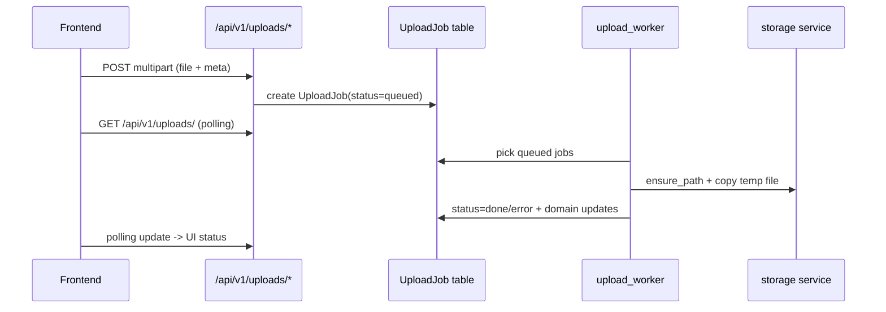

# Internal Architecture And Engineering Notes

Документ описывает внутреннее устройство системы, зоны ответственности модулей, а также текущую реализацию обработки ошибок и логирования.

## 1. Инвентаризация Документации И Встроенных Комментариев

### 1.1 Markdown-документация
- `README.md` (корень) - общий enterprise-level обзор.
- `docs/README.md` - индекс документации.
- `docs/API.md` - входная точка API-документации (генерируется из кода).
- `docs/api/INDEX.md` + `docs/api/{auth,crm,finance,documents,communications,legal_compliance,hr,platform,analytics}.md` - модульный API по бизнес-доменам (генерируется).
- `docs/PROJECT_OVERVIEW.md` - бизнес-обзор подсистем.
- `docs/DEVELOPER_ARCHITECTURE.md` - архитектура процессов для разработчика.
- `docs/MODULE_RELATIONS.md` - Mermaid-карта связей модулей.
- `docs/ADMIN_VISUAL_SYSTEM_MAP.md` - визуальная карта системы для администратора.
- `docs/OPERATIONS.md` - эксплуатационный runbook.
- `docs/DEPLOYMENT.md` - деплой/эксплуатация.
- `docs/TECHNICAL_SPECIFICATION.md` / `docs/WORK_SCHEDULE.md` - ТЗ и график внедрения.
- `docs/OUTGOING_REGISTRY.md` - специализированный документ по исходящим.
- `docs/TREASURY_AUTORULES_PROPOSALS.md` - аналитические предложения по казначейству.
- `docs/EVENTS_API.md` + `docs/EVENTS_ENTITY_REFERENCE.md` + `docs/events.json` - публичный API и каталог событий Event Bus.
- `docs/EVENT_BUS_ENTITY_COVERAGE.md`, `docs/EVENT_BUS_GAP_ANALYSIS.md`, `docs/EVENT_BUS_RESUME_v2.md` - инженерные заметки по Event Bus v2.
- `docs/INTEGRATIONS_ONBOARDING.md` - подключение внешних интеграций к Event Bus.
- `docs/MOBILE_FLUTTER_MVP.md`, `docs/IOS_CLOUD_BUILD_TESTFLIGHT.md` - мобильный клиент (Flutter) и iOS-сборка.
- `SECURITY_ASSESSMENT_2026-05-18.md` (корень) - срез безопасности.
- `SETUP_COLLEAGUE.md`, `CONTRIBUTING_AI.md` (корень) - онбординг для разработчиков и правила работы AI-агентов.

### 1.2 Встроенная документация в коде
- Python docstrings: присутствуют в `backend/main.py`, `backend/app/core/*`, большинстве `backend/app/services/*` и части `backend/app/routers/*`, `backend/app/models/*`.
- JSDoc-блоки во frontend: `frontend/src/utils/mailHelpers.js`, `frontend/src/utils/categories.js`.

## 2. Структура Кодовой Базы

## 2.1 Backend (`backend/app`)

| Папка | Ответственность |
| --- | --- |
| `core/` | Settings, JWT/security, auth middleware, rate-limit, session helpers |
| `database/` | Async/sync engine, DI session factory, declarative base |
| `models/` | SQLAlchemy ORM (84 файла) |
| `schemas/` | Pydantic контракт API (52 файла) |
| `routers/` | REST API (56 файлов, ~536 endpoint'ов в 9 доменах) |
| `services/` | Доменная логика и инфраструктурные сервисы |
| `event_handlers/` | Подписчики Event Bus v2 (search indexer, deals/tasks/leads/kp/mail/contracts/...) |
| `utils/` | локальные utility-функции |

### 2.2 Frontend (`frontend/src`)

| Папка | Ответственность |
| --- | --- |
| `views/` | экранные модули (~53 страницы + модульные `parts/`, plus `projectDetail/`, `tasks/`) |
| `router/` | маршрутизация, guard'ы, section-based доступ |
| `stores/` | auth/session, upload queue, notifications, workday |
| `services/` | HTTP interceptors, guided tour, API-обёртки по доменам |
| `components/` | глобальные/переиспользуемые компоненты (включая `MentionInput.vue` с auto-grow, `ProfileDrawer.vue`, `WorkdayTopbarChip.vue`, и др.) |
| `composables/` | composable-логика (12 файлов: `useIdleTracker`, `useServerClock`, `useUiPreferences`, и др.) |
| `config/` | конфиги навигации, типов объектов |
| `directives/` | пользовательские директивы |
| `utils/` | permissions, mail helpers, download/categories, format |

## 3. Backend Runtime Topology

### 3.1 API Процесс
- Entry point: `backend/main.py`.
- Основные middleware:
  - `CORSMiddleware` (settings + localhost профили),
  - `AuthMiddleware` (JWT + injection `request.state.user` / `is_superuser`).
- Для мутационных операций в `roles/users/companies` дополнительно применяются route-level guards через `require_section_write(section)`:
  - доступ на запись: `superuser` ИЛИ право `read_all=true` в соответствующей секции роли,
  - при отсутствии прав возвращается `HTTP 403` с `detail=Write access denied for section: <section>`.
- API объединяет bounded contexts через роутеры.

### 3.2 Фоновые процессы
- `upload_worker.py`:
  - polling queued jobs каждые 3 сек,
  - финализация файлов в storage,
  - обновление доменных сущностей по `job.module`,
  - очистка временных файлов по TTL.
- `notifications_worker.py`:
  - цикл 60 сек,
  - `process_event_logs`, `process_task_overdue`, `process_document_overdue`, `process_digests`.
- `mail_worker.py`:
  - polling подключённых mailbox по `MAIL_POLL_INTERVAL_SECONDS` (минимум 10 сек),
  - token refresh + IMAP sync.
- `event_outbox_worker.py` (Event Bus v2):
  - выгребает события из `event_outbox` (Transactional Outbox-паттерн),
  - применяет JSON-Logic условия из `event_subscription.condition_json`,
  - POST в подписчики с HMAC-подписью, retry-policy с DLQ,
  - per-entity ordering (события одной сущности — последовательно),
  - dedup на стороне consumer'а через `event_consumer_dedup`,
  - recursion guard через `causation_chain`.
- `embedding_worker.py` (Hybrid search):
  - polling `search_embeddings` где `embedding IS NULL`,
  - вычисление embedding'ов через bge-m3 (sentence-transformers + sqlite-vec, 1024-dim),
  - lazy model load, batch-обработка,
  - запускается отдельным systemd unit (`mpb-erp-test-embedding-worker`).

## 4. Взаимодействие Frontend-Backend

## 4.1 Frontend control flow
- `frontend/src/main.js`: инициализация Vue + Pinia + router + HTTP interceptors.
- `frontend/src/services/http.js`:
  - добавляет `Authorization` токен в каждый запрос,
  - централизованный refresh flow на `401`,
  - очередь повторов pending-запросов во время refresh.
- `frontend/src/router/index.js`:
  - проверка сессии,
  - redirect на `/login` при отсутствии access token,
  - route-level RBAC через `meta.section` и `hasSectionAccess`.

## 4.2 Глобальные компоненты уровня `App.vue`
- Sidebar/navigation по sections.
- Polling уведомлений (`/api/v1/notifications*`) каждые 15 сек.
- Глобальные `ToastContainer`, `UploadQueue`, `GlobalChatWidget`, `CommandPalette`.

## 4.3 Типовой поток upload queue

## 5. Ответственность Ключевых Модулей

## 5.1 Core
- `app/core/config.py`: централизованная конфигурация через `BaseSettings`.
- `app/core/security.py`: password hashing + JWT create/decode.
- `app/core/auth_middleware.py`: блокировка `/api/v1/*` и контекст текущего пользователя.

## 5.2 Domain routers (укрупнённо)
- CRM Core: `deals`, `leads`, `stages`, `products`, `tasks`, `task_subtasks`, `approvals`, `deal_execution`.
- Delivery/Contracting: `contracts`, `subcontractors*`, `task_auctions`, `tenders`, `accreditations`.
- Finance: `finance`, `income_expense`, `penalty_rules`.
- Documents: `outgoing_registry`, `document_registry`, `document_templates`, `files_catalog`, `storage`, `uploads`.
- Collaboration: `mail`, `task_messages`, `global_chat`, `feed` (корпоративная лента + опросы + реакции + @mentions + произвольные attachments), `support` (тикет-система Тех. поддержки, гейтится секцией `support`; чат тикета переиспользует механику чата задач), `telegram_notifications`.
- Legal & Compliance: `legal_work`, `accreditations`, `reglaments` (нормативная база — СП/ГОСТ/СНиП).
- HR: `profiles`, `workday`, `absences` (рабочее время, отсутствия, расширенные профили сотрудников).
- Platform: `event_bus` (outbox + subscriptions + simulate), `search` (гибрид FTS5 + bge-m3 + RRF), `ai`, `customer_portal`, `data_health`.
- Governance/ops: `roles`, `users`, `notifications*`, `dashboard`, `audit_logs`, `org_structure`.
- Пользовательские UI-настройки: `GET`/`PATCH /api/v1/users/me/ui-preferences` (JSON `user.ui_preferences`, лимит 64 КБ, deep-merge) — единый гибрид localStorage + бэкенд для темы/обоев/плотности/закреплённой навигации/представлений таблиц.

## 5.3 Services
- Financial engines: `finance_service.py`.
- Planning engines: `gantt_service.py`, `subcontractor_gantt_service.py`.
- Storage abstraction: `storage.py` (валидация локальных путей через `Path.resolve()` + `relative_to()` для защиты от Path Traversal).
- RBAC helpers: `permissions.py` (`get_section_permissions`, `allowed_deal_ids`, `require_section_write`).
- Event/audit/notify: `event_log.py`, `audit_log.py`, `notifications.py`, `notifications_engine.py`.
- Event Bus v2: `event_outbox.py` (transactional emit + causation_chain + dedup), `event_dispatcher.py` (decorator-based subscribers с `before_*`/`after_*` хуками), `event_types.py` (автогенерируемый каталог).
- Hybrid search: `search_indexer.py` (extractors per entity type для FTS5), `search_semantic.py` (bge-m3 embeddings + RRF fusion + cosine threshold).
- Mail integration: `mail_imap.py`, `mail_smtp.py`, `mail_sync.py`, `yandex_oauth.py`.
- Reglaments: `reglament_parser.py` (PyMuPDF приоритетный над pypdf), `reglament_indexer.py`.

## 6. Обработка Ошибок

### 6.1 API слой
- Основной механизм: `HTTPException(status_code, detail)`.
- В кодовой базе обнаружено >500 точек явного выброса `HTTPException` (валидация, permission checks, not found, infra-fail).
- Во многих роутерах бизнес-ошибки нормализованы в 4xx.
- Для write-операций `roles/users/companies` стандартный отказ авторизации: `HTTP 403` (`Write access denied for section: <section>`).

### 6.2 Worker слой
- `upload_worker.py`: ошибочные jobs переводятся в `status="error"` и пишут событие `upload.error`.
- `mail_worker.py`: исключения по отдельному mailbox не останавливают loop.
- `notifications_worker.py`: периодические задачи выполняются батчем в одном цикле.

### 6.3 Model/Router fallback-паттерны
- В части методов используются `try/except` + `print(...)` с возвратом fallback-значений (`[]`, `0`, `None`).
- Это сохраняет работоспособность API, но снижает наблюдаемость в production.

## 7. Логирование И Аудит

## 7.1 Текущее состояние
- SQLAlchemy engine в `database/session.py` запускается с `echo=True` (высокая детализация SQL-логов).
- Логирование смешанного типа:
  - `print(...)` во многих routers/models/services,
  - ограниченное использование `logging.getLogger` (`deal_execution.py`, `companies.py`).
- Бизнес-аудит:
  - `EventLog` через `app/services/event_log.py`,
  - `AuditLog` через `app/services/audit_log.py`,
  - notification engine читает `EventLog`.

## 7.2 Риски
- Непоследовательный формат логов (print vs logger).
- Нет единой корреляции запросов (request id / trace id).
- Сложнее строить централизованный мониторинг и алертинг.

## 7.3 Рекомендации для enterprise hardening
1. Перевести `print(...)` на structured logging (`logging` + JSON formatter).
2. Ввести correlation id middleware и прокидывание id в worker-события.
3. Разделить уровни логирования по средам (`dev`, `stage`, `prod`) и отключить SQL `echo` в production.
4. Стандартизировать error envelope (code/message/context) поверх `detail`.
5. Добавить централизованный sink (ELK/OpenSearch/Loki/Sentry) и метрики ошибок по роутам.

## 8. Операционные Заметки
- По умолчанию проект ориентирован на SQLite dev-сценарий; production следует вести на PostgreSQL.
- Миграции в репозитории смешанного типа (`create_*.py`, `migrate_*.py`), без единой ревизионной цепочки Alembic.
- Для enterprise-подхода рекомендуется унифицировать миграции и CI-проверку schema drift.

## 9. Безопасность И Ключевые Архитектурные Паттерны

### 9.1 Section-based RBAC + per-row ACL для child-entity

Базовый слой — section-based матрица прав (`role_permissions.read_all`/`read_assigned`), читается через `app/services/permissions.py`.

Однако одна section может содержать сущности, видимость которых на самом деле определяется родителем из ДРУГОЙ section. Эта классическая «cross-section leak» ситуация была выявлена 28 мая в `/api/v1/search`:

- `task_message`, `task_subtask` имели формальную секцию `task_chat`, но реально доступ привязан к задаче (section `tasks`);
- `outgoing_document`, `document` имели свои секции, но фактический gate шёл через родительский deal (section `projects`);
- `kp_document` через родительский lead, `support_ticket` через owner (`created_by_id`).

Текущая реализация в `backend/app/routers/search.py`:
1. До per-row цикла резолвится один раз `read_all` для всех ключевых родительских секций (`tasks`, `projects`, `leads`, `support`).
2. Если у пользователя нет `read_all` на родительской секции — собирается `allowed_<parent>_ids` (через `deal_gips`, `leads.responsible_user_id`, `tasks.created_by_user_id`/`assigned_to_user_id`/`task_assignees`/`task_watchers`).
3. На per-row loop child-entity всегда проходит через резолв родителя, **независимо от section_mode**. Это закрывает кейс «у юзера `task_chat.read_all=1`, `tasks.read_all=0` → видит чужие task_messages в поиске».

Паттерн применим ко всем child-entity типам, попадающим в FTS5. Аналогичную проверку нужно встраивать в любой новый «cross-search» эндпоинт.

### 9.2 Hybrid Search (FTS5 + bge-m3 + RRF)

- **Step 0 (lexical)**: `search_fts` (FTS5, unicode61, title boost через `bm25(search_fts, 3.0, 1.0)`).
- **Step 1 (semantic)**: `search_embeddings` (sqlite-vec, 1024-dim bge-m3). Активируется через `ENABLE_HYBRID_SEARCH=1` + порог по количеству embeddings на тип.
- **Fusion**: Reciprocal Rank Fusion (RRF, `K=60`) поверх двух источников. Cosine-threshold для семантических кандидатов (`MIN_COSINE=0.55`) отсекает шум на маленьких корпусах.
- **Reglaments** (нормативная база) — изолированный домен: отдельные `reglament_fts` и `reglament_embeddings`, чтобы не смешивать с основной CRM-выдачей.
- **Bootstrap**: `_index_all.py` (FTS5 переиндекс), `_embed_all.py` (batch embedding), `_embed_reglaments.py`.

### 9.3 Event Bus v2

- Storage: `event_outbox` (Transactional Outbox) + `event_subscription` (URL + headers + condition_json + retry_policy) + `event_consumer_dedup` (для consumer-side idempotency).
- Emit-точка: `emit_event_safe(db, event_type, entity_type, entity_id, payload, payload_version)` (transactional, attach к текущей UoW).
- Dispatcher: `app/event_handlers/*` — подписки через `@on('event_type')` декоратор + `BeforeResult` для блокирующих хуков (state-machine guards в `contracts`, `deals`, и т.п.).
- Worker (`event_outbox_worker.py`) — отдельный процесс, batch-обработка с per-entity ordering, HMAC-подпись, JSON-Logic фильтрация по условию подписки.
- Catalog: `event_types.py` автогенерируется + `docs/events.json` — единый каталог поддерживаемых событий (~140+ типов).

### 9.4 Feed file attachments — раздельное хранилище

- Images (`feed.upload-image`) → `static/feed/<uuid>.<ext>`, отдаются через `/api/v1/feed/image/<filename>`.
- Files (`feed.upload-file`) → `static/feed-files/<uuid>.<ext>`, отдаются через `/api/v1/feed/file/<filename>?name=<orig>` (Content-Disposition с оригинальным именем для скачивания).
- Это сужает поверхность атаки `/image/<name>` — он отдаёт только картинки.
- `FeedAttachment` имеет поле `kind` (`"image"` / `"file"`) для backward compatibility: посты до Феда v3 не имеют `kind` → дефолтом считаются изображениями.
