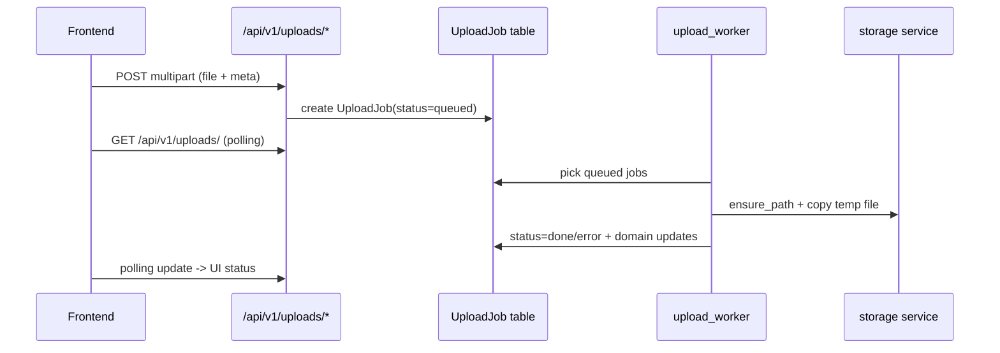

# Internal Architecture And Engineering Notes

Документ описывает внутреннее устройство системы, зоны ответственности модулей, а также текущую реализацию обработки ошибок и логирования.

## 1. Инвентаризация Документации И Встроенных Комментариев

### 1.1 Markdown-документация
- `README.md` (корень) - общий enterprise-level обзор.
- `docs/README.md` - индекс документации.
- `docs/API.md` - входная точка API-документации.
- `docs/api/INDEX.md` - модульный индекс API по бизнес-доменам.
- `docs/PROJECT_OVERVIEW.md` - бизнес-обзор подсистем.
- `docs/DEPLOYMENT.md` - деплой/эксплуатация.
- `docs/OUTGOING_REGISTRY.md` - специализированный документ по исходящим.
- `docs/TREASURY_AUTORULES_PROPOSALS.md` - аналитические предложения по казначейству.

### 1.2 Встроенная документация в коде
- Python docstrings: присутствуют в `backend/main.py`, `backend/app/core/*`, большинстве `backend/app/services/*` и части `backend/app/routers/*`, `backend/app/models/*`.
- JSDoc-блоки во frontend: `frontend/src/utils/mailHelpers.js`, `frontend/src/utils/categories.js`.

## 2. Структура Кодовой Базы

## 2.1 Backend (`backend/app`)

| Папка | Ответственность |
| --- | --- |
| `core/` | Settings, JWT/security, auth middleware |
| `database/` | Async/sync engine, DI session factory, declarative base |
| `models/` | SQLAlchemy ORM (69 файлов) |
| `schemas/` | Pydantic контракт API (54 файла) |
| `routers/` | REST API (42 файла, ~350 endpoint'ов) |
| `services/` | Доменная логика и инфраструктурные сервисы |
| `utils/` | локальные utility-функции |

### 2.2 Frontend (`frontend/src`)

| Папка | Ответственность |
| --- | --- |
| `views/` | экранные модули (35 файлов) |
| `router/` | маршрутизация, guard'ы, section-based доступ |
| `stores/` | auth/session + upload queue |
| `services/` | HTTP interceptors, guided tour |
| `components/` | глобальные/переиспользуемые компоненты |
| `utils/` | permissions, mail helpers, download/categories |

## 3. Backend Runtime Topology

### 3.1 API Процесс
- Entry point: `backend/main.py`.
- Основные middleware:
  - `CORSMiddleware` (settings + localhost профили),
  - `AuthMiddleware` (JWT + injection `request.state.user` / `is_superuser`).
- Для мутационных операций в `roles/users/companies` дополнительно применяются route-level guards через `require_section_write(section)`:
  - доступ на запись: `superuser` ИЛИ право `read_all=true` в соответствующей секции роли,
  - при отсутствии прав возвращается `HTTP 403` с `detail=Write access denied for section: <section>`.
- API объединяет bounded contexts через роутеры.

### 3.2 Фоновые процессы
- `upload_worker.py`:
  - polling queued jobs каждые 3 сек,
  - финализация файлов в storage,
  - обновление доменных сущностей по `job.module`,
  - очистка временных файлов по TTL.
- `notifications_worker.py`:
  - цикл 60 сек,
  - `process_event_logs`, `process_task_overdue`, `process_document_overdue`, `process_digests`.
- `mail_worker.py`:
  - polling подключённых mailbox по `MAIL_POLL_INTERVAL_SECONDS` (минимум 10 сек),
  - token refresh + IMAP sync.

## 4. Взаимодействие Frontend-Backend

## 4.1 Frontend control flow
- `frontend/src/main.js`: инициализация Vue + Pinia + router + HTTP interceptors.
- `frontend/src/services/http.js`:
  - добавляет `Authorization` токен в каждый запрос,
  - централизованный refresh flow на `401`,
  - очередь повторов pending-запросов во время refresh.
- `frontend/src/router/index.js`:
  - проверка сессии,
  - redirect на `/login` при отсутствии access token,
  - route-level RBAC через `meta.section` и `hasSectionAccess`.

## 4.2 Глобальные компоненты уровня `App.vue`
- Sidebar/navigation по sections.
- Polling уведомлений (`/api/v1/notifications*`) каждые 15 сек.
- Глобальные `ToastContainer`, `UploadQueue`, `GlobalChatWidget`, `CommandPalette`.

## 4.3 Типовой поток upload queue

## 5. Ответственность Ключевых Модулей

## 5.1 Core
- `app/core/config.py`: централизованная конфигурация через `BaseSettings`.
- `app/core/security.py`: password hashing + JWT create/decode.
- `app/core/auth_middleware.py`: блокировка `/api/v1/*` и контекст текущего пользователя.

## 5.2 Domain routers (укрупнённо)
- CRM Core: `deals`, `leads`, `stages`, `products`, `tasks`, `deal_execution`.
- Delivery/Contracting: `contracts`, `subcontractors*`, `task_auctions`, `tenders`, `accreditations`.
- Finance: `finance`, `income_expense`, `economy`, `penalty_rules`.
- Documents: `outgoing_registry`, `document_registry`, `files_catalog`, `storage`, `uploads`.
- Collaboration: `mail`, `task_messages`, `global_chat`.
- Governance/ops: `roles`, `users`, `notifications*`, `dashboard`, `audit_logs`.

## 5.3 Services
- Financial engines: `finance_service.py`, `economy_service.py`.
- Planning engines: `gantt_service.py`, `subcontractor_gantt_service.py`.
- Storage abstraction: `storage.py` (валидация локальных путей через `Path.resolve()` + `relative_to()` для защиты от Path Traversal).
- RBAC helpers: `permissions.py` (`get_section_permissions`, `allowed_deal_ids`, `require_section_write`).
- Event/audit/notify: `event_log.py`, `audit_log.py`, `notifications.py`, `notifications_engine.py`.
- Mail integration: `mail_imap.py`, `mail_smtp.py`, `mail_sync.py`, `yandex_oauth.py`.

## 6. Обработка Ошибок

### 6.1 API слой
- Основной механизм: `HTTPException(status_code, detail)`.
- В кодовой базе обнаружено >500 точек явного выброса `HTTPException` (валидация, permission checks, not found, infra-fail).
- Во многих роутерах бизнес-ошибки нормализованы в 4xx.
- Для write-операций `roles/users/companies` стандартный отказ авторизации: `HTTP 403` (`Write access denied for section: <section>`).

### 6.2 Worker слой
- `upload_worker.py`: ошибочные jobs переводятся в `status="error"` и пишут событие `upload.error`.
- `mail_worker.py`: исключения по отдельному mailbox не останавливают loop.
- `notifications_worker.py`: периодические задачи выполняются батчем в одном цикле.

### 6.3 Model/Router fallback-паттерны
- В части методов используются `try/except` + `print(...)` с возвратом fallback-значений (`[]`, `0`, `None`).
- Это сохраняет работоспособность API, но снижает наблюдаемость в production.

## 7. Логирование И Аудит

## 7.1 Текущее состояние
- SQLAlchemy engine в `database/session.py` запускается с `echo=True` (высокая детализация SQL-логов).
- Логирование смешанного типа:
  - `print(...)` во многих routers/models/services,
  - ограниченное использование `logging.getLogger` (`deal_execution.py`, `companies.py`).
- Бизнес-аудит:
  - `EventLog` через `app/services/event_log.py`,
  - `AuditLog` через `app/services/audit_log.py`,
  - notification engine читает `EventLog`.

## 7.2 Риски
- Непоследовательный формат логов (print vs logger).
- Нет единой корреляции запросов (request id / trace id).
- Сложнее строить централизованный мониторинг и алертинг.

## 7.3 Рекомендации для enterprise hardening
1. Перевести `print(...)` на structured logging (`logging` + JSON formatter).
2. Ввести correlation id middleware и прокидывание id в worker-события.
3. Разделить уровни логирования по средам (`dev`, `stage`, `prod`) и отключить SQL `echo` в production.
4. Стандартизировать error envelope (code/message/context) поверх `detail`.
5. Добавить централизованный sink (ELK/OpenSearch/Loki/Sentry) и метрики ошибок по роутам.

## 8. Операционные Заметки
- По умолчанию проект ориентирован на SQLite dev-сценарий; production следует вести на PostgreSQL.
- Миграции в репозитории смешанного типа (`create_*.py`, `migrate_*.py`), без единой ревизионной цепочки Alembic.
- Для enterprise-подхода рекомендуется унифицировать миграции и CI-проверку schema drift.
