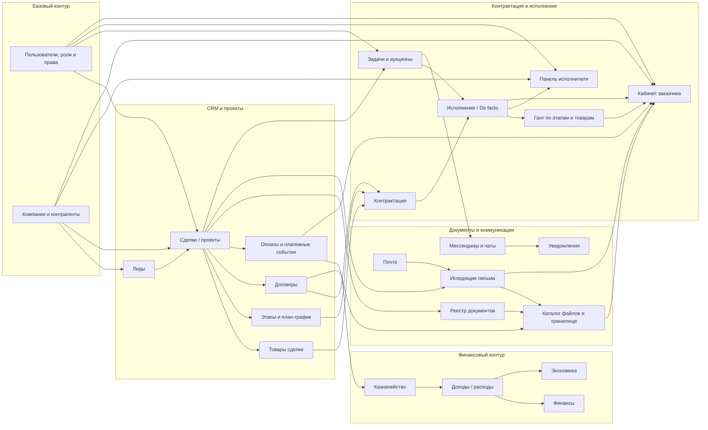

# Module Relations

Документ фиксирует верхнеуровневые связи между основными модулями `Nexus ERP`.

Диаграмма ниже не претендует на детализацию по каждой таблице или API-роуту. Ее задача —
показать, как бизнес-контуры связаны между собой на уровне экранов, сущностей и потоков данных.

## Mermaid Diagram

## Краткая Логика Связей

- `Лиды` являются входом в воронку и при успешной квалификации переходят в `Сделки / проекты`.
- `Сделка / проект` является центральной сущностью, к которой привязаны товары, этапы, договоры, оплаты, задачи, документы и исходящие письма.
- `Контрактация` связывает этапы, товары и договорный контур, после чего переходит в слой `Исполнения`.
- `Исполнение / De facto` управляет назначениями исполнителей, рабочими сроками, договорными сроками, подзадачами и gantt-представлениями.
- `Панель исполнителя` показывает только назначенные пользователю объекты, товары и подзадачи.
- `Кабинет заказчика` строится на данных проекта, оплат, gantt, документов и исходящих писем, видимых заказчику.
- `Казначейство`, `Доходы / расходы`, `Финансы` и `Экономика` образуют единый финансовый контур, связанный с платежами и проектами.
- `Реестр документов`, `Каталог файлов`, `Исходящие письма` и `Почта` формируют единый документный и коммуникационный слой.

## Где Использовать Эту Диаграмму

- в `docs/PROJECT_OVERVIEW.md` как верхнеуровневую карту модулей;
- в `docs/TECHNICAL_SPECIFICATION.md` как схему предметного контура;
- в презентационных и договорных материалах как краткое описание состава платформы.
