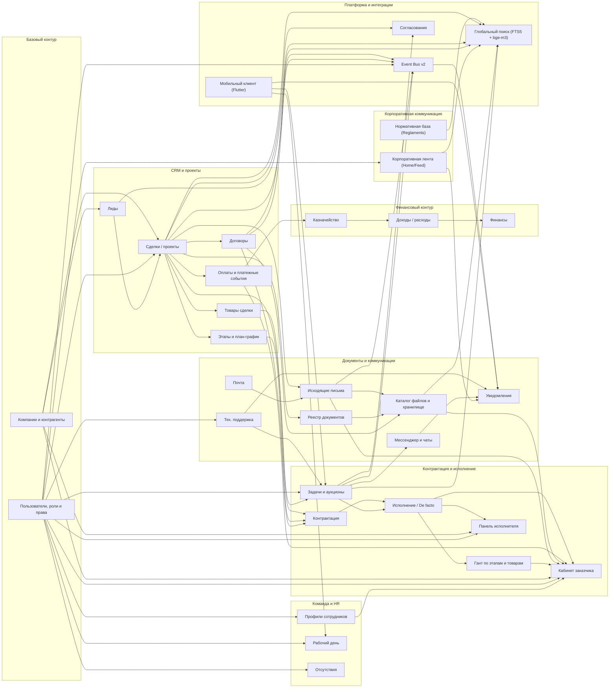

# Module Relations

Документ фиксирует верхнеуровневые связи между основными модулями `Nexus ERP`.

Диаграмма ниже не претендует на детализацию по каждой таблице или API-роуту. Ее задача —
показать, как бизнес-контуры связаны между собой на уровне экранов, сущностей и потоков данных.

## Mermaid Diagram

## Краткая Логика Связей

- `Лиды` являются входом в воронку и при успешной квалификации переходят в `Сделки / проекты`.
- `Сделка / проект` является центральной сущностью, к которой привязаны товары, этапы, договоры, оплаты, задачи, документы и исходящие письма.
- `Контрактация` связывает этапы, товары и договорный контур, после чего переходит в слой `Исполнения`.
- `Исполнение / De facto` управляет назначениями исполнителей, рабочими сроками, договорными сроками, подзадачами и gantt-представлениями.
- `Панель исполнителя` показывает только назначенные пользователю объекты, товары и подзадачи.
- `Кабинет заказчика` строится на данных проекта, оплат, gantt, документов и исходящих писем, видимых заказчику.
- `Казначейство`, `Доходы / расходы` и `Финансы` образуют финансовый контур, связанный с платежами и проектами.
- `Реестр документов`, `Каталог файлов`, `Исходящие письма` и `Почта` формируют единый документный и коммуникационный слой.
- `Тех. поддержка` — тикет-система: пользователь заводит обращение, сотрудник поддержки ведёт его, может породить `Задачу` из тикета и инициирует `Уведомления`.
- **HR-блок** (`Профили / Рабочий день / Отсутствия`) живёт от пользователей, через секционные права `profiles`/`workday`/`absences`. `Workday` пишет фактические сессии работы, `Absences` — отпуска и больничные с таймлайном.
- **`Корпоративная лента`** (`Home / Feed`) — корпоративная коммуникация: посты, опросы, реакции, комментарии, @mentions, прикрепление изображений и файлов. Источник `feed_*` событий для `Уведомлений`.
- **`Нормативная база`** (`Reglaments`) — каталог СП/ГОСТ/СНиП с собственным изолированным поисковым доменом (`reglament_fts` + `reglament_embeddings`). Питает свой раздел `Поиска`, не пересекается с основным CRM-индексом.
- **`Согласования`** (`Approvals`) — состояния согласования по сделкам/проектам/задачам с шаблонами и шагами.
- **`Глобальный поиск`** — гибридный (FTS5 BM25 + bge-m3 cosine, объединение через RRF). Индексирует Сделки/Задачи/Лиды/Договоры/Файлы/Посты ленты/Нормы. ACL применяется per-row (child-entity сущности проверяются через родителя — см. `INTERNAL.md` §9.1).
- **`Event Bus v2`** — шина для интеграций с внешними системами: transactional outbox + подписки с JSON-Logic фильтрацией + HMAC-подпись + retry/DLQ. Источники: эмиссии из сделок/задач/договоров/исходящих/пользователей. Потребители: внешние сервисы (Telegram, 1С, Диадок, ЭЦП и т.п.) + внутренний `search_indexer` как первый consumer.
- **`Мобильный клиент`** — Flutter-приложение (`mobile_app/`) с фокусом на уведомления, задачи и рабочее время. CI через Codemagic.

## Где Использовать Эту Диаграмму

- в `docs/PROJECT_OVERVIEW.md` как верхнеуровневую карту модулей;
- в `docs/TECHNICAL_SPECIFICATION.md` как схему предметного контура;
- в презентационных и договорных материалах как краткое описание состава платформы.
